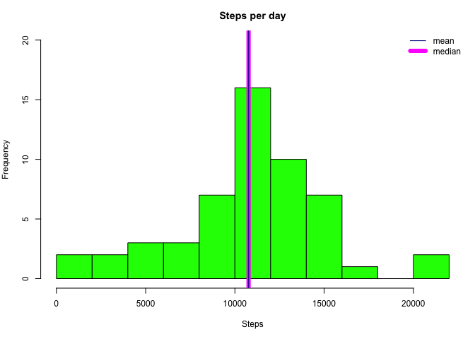
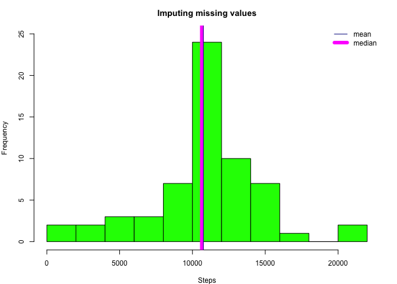
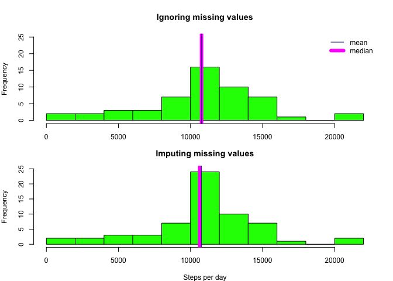

  
## Loading and preprocessing the data

  
#### Load the data

```r
data <- read.csv("data/activity.csv")
summary(data$steps)
```

```
##    Min. 1st Qu.  Median    Mean 3rd Qu.    Max.    NA's 
##     0.0     0.0     0.0    37.4    12.0   806.0    2304
```
  
#### Preprocess data

```r
#fill interval values with missing 0s 
data$interval <- sapply(data$interval, function(int) {
    missing0s <- 4 - nchar(int)
    paste0(paste(rep("0", missing0s), collapse = ''), int)
})
data$date <- as.Date(data$date)
#datetime column contains date + time
data$datetime <- strptime(paste(data$date, data$interval), format="%Y-%m-%d %H%M")
data$datetime <- as.POSIXct(data$datetime)
#weekday column tells in which day we are
data$weekday <- factor(weekdays(data$date, abbreviate=T), 
                       levels = c("Mon", "Tue", "Wed", "Thu", "Fri", "Sat", "Sun"))
#weekend column, showing if the current day is weekend(1) or weekday(0) 
data$weekend <- rep(0, nrow(data))
weekendRows <- which(data$weekday %in% c("Sat", "Sun"))
data$weekend[weekendRows] <- 1
data$weekend <- factor(data$weekend)
```
  
## What is mean total number of steps taken per day?

#### Calculate and report the mean and median total number of steps taken per day

```r
# load sqldf, used to compute aggregates of data
# if sqldf not installed, need to install it first!
library(sqldf)
```

```r
dataNoNAs <- data[!is.na(data$steps), ]
t <- dataNoNAs
sql <- "select date, sum(steps) as totalSteps from t group by date" 
dataDayTotal <- sqldf(sql)
stepsMean <- mean(dataDayTotal$totalSteps)
stepsMedian <- median(dataDayTotal$totalSteps)
```
  The mean total steps taken per day is 10766.19 and the median 10765

#### Make a histogram of the total number of steps taken each day

```r
par(mar = c(5, 4, 3, 1), mfrow = c(1,1), cex = 0.75)
hist(dataDayTotal$totalSteps, breaks = 10, col = "green", xlab = "Steps", 
     main = "Steps per day", ylim = c(0, 20))
abline(v=stepsMedian, col="magenta", lwd = 6)
abline(v=stepsMean, col="darkblue", lwd = 1)
legend("topright", lty = 1, lwd = c(1, 6), col = c("darkblue", "magenta"), 
       legend = c("mean", "median"), xjust = 0, yjust = 0, bty = "n")
```

 
  
## What is the average daily activity pattern?
#### Which 5-minute interval, on average across all the days in the dataset, contains the maximum number of steps?

```r
sql <- "select interval, sum(steps)/count(distinct(date)) avgSteps 
        from t group by interval order by abs(interval)"
dataInterval <- sqldf(sql)
idxMax <- which(dataInterval$avgSteps == max(dataInterval$avgSteps))
intervalMax <- dataInterval[idxMax,'interval']
```
  The interval containing in average the maximum number of steps is  0835
  
#### Make a time series plot of the 5-minute interval (x-axis) and the average number of steps taken, averaged across all days (y-axis)

```r
par(mar = c(5, 4, 3, 1), mfrow = c(1,1), cex = 0.75)
with(dataInterval,  plot(interval, avgSteps,  main="Steps", xlab="interval", 
                         ylab="Average number of steps", type = "l", col = "blue"))

abline(v=intervalMax, col="red", lty = 2)
```

 
  
## Imputing missing values

#### Calculate and report the total number of missing values in the dataset

```r
rowIds <- which(is.na(data$steps))
totalNAs <- length(rowIds)
```
  The total number of missing values is 2304  
  
#### Devise a strategy for filling in all of the missing values in the dataset.

```r
# estimate missing steps as the average number of steps for this interval
estimateSteps <- function(id) {
  intVal <- dataComplete[id, 'interval']
  dataInterval[dataInterval$interval == intVal, 'avgSteps']
}
```
  
#### Create a new dataset that is equal to the original dataset but with the missing data filled in

```r
dataComplete <- data.frame(data)
for (id in rowIds) {
  dataComplete[id, 'steps'] <- estimateSteps(id)
}
```
  
  Print summary of the steps column in the new dataset to check that there are no NAs

```r
summary(dataComplete$steps)
```

```
##    Min. 1st Qu.  Median    Mean 3rd Qu.    Max. 
##     0.0     0.0     0.0    37.3    27.0   806.0
```
  
#### Build histogram and compute new mean and median steps taken per day

```r
t <- dataComplete
sql <- "select date, sum(steps) as totalSteps from t group by date" 
dataCompleteDay <- sqldf(sql)

newMean = mean(dataCompleteDay$totalSteps)
newMedian = median(dataCompleteDay$totalSteps)

par(mfrow = c(1, 1),  mar = c(4, 4, 3, 2), oma = c(0, 0, 0, 0), cex = 0.75)
hist(dataCompleteDay$totalSteps, breaks = 10, col = "green", xlab = "Steps", main = "Imputing missing values", ylim = c(0, 25))
abline(v=newMedian, col="magenta", lwd = 6)
abline(v=newMean, col="darkblue", lwd = 1)
legend("topright", lty = 1, lwd = c(1, 6), col = c("darkblue", "magenta"), 
       legend = c("mean", "median"), xjust = 0, yjust = 0, bty = "n")
```

 

  The new mean is 10749.77 and the new median is 10641
  
#### Do these values differ from the estimates from the first part of the assignment? What is the impact of imputing missing data on the estimates of the total daily number of steps?

  In the next plot we see a comparison of the histograms of the datasets with and without imputed values

```r
# build a panel with both histograms
par(mfrow = c(2, 1),  mar = c(2, 4, 4, 2), oma = c(0, 0, 0, 0), cex = 0.75) #mar = c(3, 3, 3, 1),
hist(dataDayTotal$totalSteps, breaks = 10, col = "green", xlab = "Steps per day", main = "Ignoring missing values", ylim = c(0, 25))
abline(v = stepsMedian, col="magenta", lwd = 6)
abline(v = stepsMean, col="darkblue", lwd = 1)
legend("topright", lty = 1, lwd = c(1, 6), col = c("darkblue", "magenta"), 
       legend = c("mean", "median"), xjust = 0, yjust = 0, bty = "n")

par(mar = c(4, 4, 3, 2))
hist(dataCompleteDay$totalSteps, breaks = 10, col = "green", xlab = "Steps per day", main = "Imputing missing values", ylim = c(0, 25 ))
abline(v=newMedian, col="magenta", lwd = 6)
abline(v=newMean, col="darkblue", lwd = 1)
```

 

  The imputation of missing data on estimates do have an effect on the distribution. The mean and the median are slightly higher when the missing values are ignored. This happens because during the imputation process many values under the median have been introduced.  Also the distribution of the dataset with imputed missing values has more days where the total steps are close to the median (and mean).
  
## Are there differences in activity patterns between weekdays and weekends?

#### Create a new factor variable in the dataset with two levels – “weekday” and “weekend” indicating whether a given date is a weekday or weekend day.

```r
#weekday column tells in which day we are
data$weekday <- factor(weekdays(data$date, abbreviate=T), 
                       levels = c("Mon", "Tue", "Wed", "Thu", "Fri", "Sat", "Sun"))
#weekend column, showing if the current day is weekend(1) or weekday(0) 
data$weekend <- rep(0, nrow(data))
weekendRows <- which(data$weekday %in% c("Sat", "Sun"))
data$weekend[weekendRows] <- 1
data$weekend <- factor(data$weekend)
```
  
#### Make a panel plot containing a time series plot of the 5-minute interval (x-axis) and the average number of steps taken, averaged across all weekday days or weekend days (y-axis).

```r
# get data grouped by intervals and weekend column
sql <- "select interval, weekend, sum(steps)/count(distinct(date)) avgSteps 
      from t group by weekend,interval order by abs(interval)" 
dataIntervalWeekend <- sqldf(sql)

# set option 2 graphs in vertical
par(mfrow = c(2, 1),  mar = c(2, 4, 4, 2), oma = c(0, 0, 0, 0), cex = 0.75)
#plot data for weekdays
dataIntervalWeekend0 <- subset(dataIntervalWeekend, weekend == 0)
with(dataIntervalWeekend0, plot(interval, avgSteps, col = "blue", type = "l", lwd = 2, main= "weekdays", ylab = "Number of steps", xlab = ""))
idxMax <- which(dataIntervalWeekend0$avgSteps == max(dataIntervalWeekend0$avgSteps))
intervalMax <- dataIntervalWeekend0[idxMax,]
abline(v=intervalMax$interval, col="red", lty = 2)
#plot data for weekends
dataIntervalWeekend1 <- subset(dataIntervalWeekend, weekend == 1)
par(mar = c(4, 4, 3, 2))
with(dataIntervalWeekend1, plot(interval, avgSteps, col = "blue", type = "l", lwd = 2, main = "weekend", ylab = "Number of steps", xlab = "Interval", mar = c(4, 5, 2, 1)))
idxMax <- which(dataIntervalWeekend1$avgSteps == max(dataIntervalWeekend1$avgSteps))
intervalMax <- dataIntervalWeekend1[idxMax,]
abline(v=intervalMax$interval, col="red", lty = 2)
```

 

  During the weekends, the activity is not starting so early as in the weekdays. Even though the interval 08:35 still has many steps, but the interval with maximum number of steps is a bit later i.e. 09:15. Moreover, it can be observed that in the weekends there is in average more activity (steps) distributed along the day, and the activity is decreasing from about 21:00 on, whereas in weekday the activity ceases earlier, about 19:00.

  In the next plot we see in a boxplot the 5 numbers summaries for both subsets, weekdays and weekends. There can be seen that the median is slightly higher during the weekends. And there is somehow more variability in the data, since the distance between the first and third quantiles is higher.

```r
par(mfrow = c(1, 1),  mar = c(4, 4, 3, 2), oma = c(0, 0, 0, 0), cex = 0.75)
with(dataIntervalWeekend, boxplot(avgSteps ~ weekend, main = "weekdays vs weekend", 
                            xaxt = "n" ))
axis(1, at = c(1, 2), labels = c("weekdays", "weekend"))
```

 
